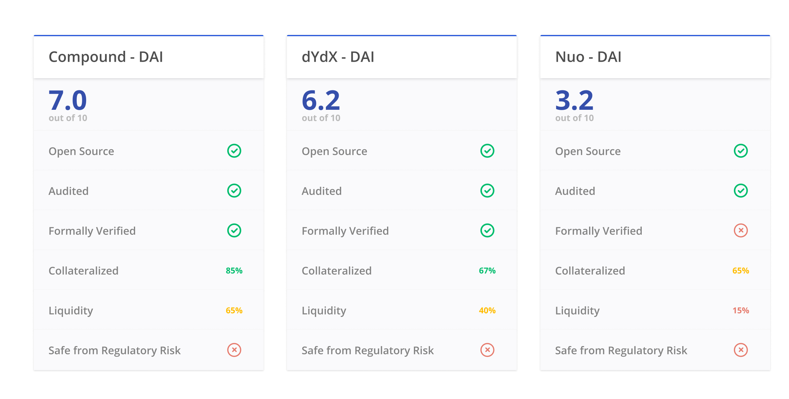

The DeFi Score is a framework for assessing risk in permissionless lending platforms. It's a single, consistently comparable value for measuring protocol risk, based on factors including smart contract risk, collateralization, and liquidity.

We encourage the Ethereum community to evolve the methodology, making it more effective and easier to use.

* Read the detailed [whitepaper](whitepaper.md).
* Join the discussion on [Telegram](https://t.me/defiscore).

## Table of Contents
* [Scores](#scores)
* [Example Implementation](#example-implementation)
* [Components](#components)
* [Further Reading](#further-reading)
* [Contributors](#contributors)

## Scores
We've provided a few scores from early versions of the model and have included reasons why they score the way they do.

| Pool           | DeFi Score (0-10) | Why?                                                        |
|----------------|------------|-------------------------------------------------------------|
| Compound - ETH | 8.5        | Audited, formally verified, highest liquidity in the market |
| Compound - DAI | 5.5        | One of the least liquid compound markets historically       |
| Compound - ZRX | 6.0        | Middling liquidity                                          |
| dYdX - ETH     | 7.0        | Good liquidity, no formal verification                      |
| dYdX - DAI     | 5.2        | Low liquidity                                               |

## Example Implementation
Although the underlying methodology is complex, it should be simple for a user to understand.

## Components
The DeFi Score methodology can be organized into Smart Contract Risk, Financial Risk, and Other Considerations.

### I. Smart Contract Risk

* #### Smart Contract Security (35%)
  Errors, bugs and unexpected outcomes in smart contracts can cause real financial harm. These risks can be minimized by proactive code audits and formal verification from reputable security firms.

  Our model assesses code security by looking at three pieces of off-chain but public data:

  1. **Audited Code:** Has the code been audited by a reputable security team?
  2. **Formal Verification:** Has the code been formally verified by a reputable security team?
  3. **Bounty Program:** Does the development team offers a public bug bounty program?

* #### Smart Contract Openness (15%)
  Part of the promise of DeFi is that the functionality of smart contracts is completely on-chain, which means they are verifiable and transparent. Developers of DeFi platforms still have the ability to obscure their code in various ways, such as not verifying the bytecode and using off chain oracles processes. Security through obscurity offers weak security guarantees at best, and at worst results in delays in finding critical bugs.

### II. Financial Risk

* #### Collateral (25%)
  Part of the promise of DeFi is that the functionality of smart contracts is completely on-chain, which means they are verifiable and transparent. Developers of DeFi platforms still have the ability to obscure their code in various ways, such as not verifying the bytecode and using off chain oracles processes. Security through obscurity offers weak security guarantees at best, and at worst results in delays in finding critical bugs.

* #### Liquidity (10%)
  The currently scoped platforms all attempt to incentive liquidity by using dynamic interest rate models which produce varying rates depending on the level of liquidity in each asset pool. However, incentivized liquidity does not mean guaranteed liquidity. The absolute level of liquidity is used instead of the percentage utilization (outstandingDebt/totalAssets) because it has a side effect of also scoring larger pools higher.

### III. Other Considerations

* #### Insurance/Regulatory Risk (15%)
  While there are some promising innovations in the DeFi insurance space, none are widespread or mature enough yet. Also, none of these platforms’ development teams are actually decentralized yet and none have been approved by the United States or other nations’ banking/finance regulatory bodies yet.

## Further Reading:
[DeFi Score: Assessing Risk in Permissionless Lending Protocols](whitepaper.md)

## Contributors
### Key Contributors:
* Jack Clancy
<!-- ALL-CONTRIBUTORS-LIST:START - Do not remove or modify this section -->
<!-- prettier-ignore-start -->
<!-- markdownlint-disable -->
<table>
  <tr>
    <td align="center"><a href="https://github.com/jclancy93"> <b>Jack Clancy</b></a> <a href="https://github.com/ConsenSys/defi-score/commits?author=jclancy93" title="Code">💻</a> <a href="https://github.com/ConsenSys/defi-score/commits?author=jclancy93" title="Documentation">📖</a> <a href="#talk-jclancy93" title="Talks">📢</a></td>
    <td align="center"><a href="https://twitter.com/JordanLyall"> <b>Jordan Lyall</b></a> <a href="#projectManagement-jordanlyall" title="Project Management">📆</a> <a href="https://github.com/ConsenSys/defi-score/commits?author=jordanlyall" title="Documentation">📖</a> <a href="#design-jordanlyall" title="Design">🎨</a></td>
  </tr>
</table>

<!-- markdownlint-enable -->
<!-- prettier-ignore-end -->
<!-- ALL-CONTRIBUTORS-LIST:END -->

### Additional Contributors:
* [Jordan Lyall](https://3box.io/0xcf88fa6ee6d111b04be9b06ef6fad6bd6691b88c/)
* [Todd Murtha](https://www.3box.io/0x3e5a3f30695949ce0541c8f1843acbdf1557a382)
* [Thomas Lipari](https://3box.io/0xcb28e9eaf9fed40c3147fa832a4afdef28a8684b)

## Community
Join the DeFi Score community on [Telegram](https://t.me/defiscore).

## License
 This work is licensed under a <a rel="license" href="http://creativecommons.org/licenses/by-sa/2.0/">Creative Commons Attribution-ShareAlike 2.0 Generic License</a>.
