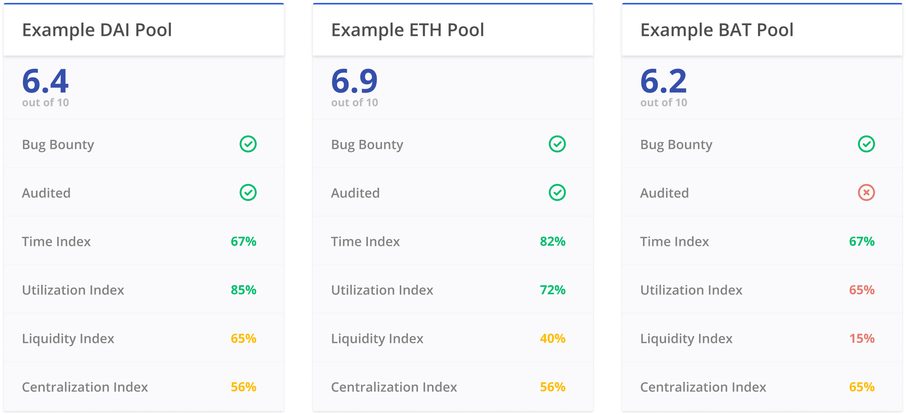

The DeFi Score is a framework for assessing risk in permissionless lending platforms. It's a single, consistently comparable value for measuring protocol risk, based on factors including smart contract risk, collateralization, and liquidity.

We encourage the Ethereum community to evolve the methodology, making it more effective and easier to use.

* See live scores at [defiscore.io](https://defiscore.io).
* Read the detailed [whitepaper](whitepaper.md).
* Join the discussion on [Telegram](https://t.me/defiscore).

## Table of Contents
* [Example Scores](#example-scores)
* [Implementation](#implementation)
* [Components](#components)
* [Further Reading](#further-reading)
* [Contributors](#contributors)

## Example Scores
We've provided a few example scores with a breakdown of each component. Although the underlying methodology is complex, it should be simple for a user to understand.

## Implementation
Want to run the numbers yourself? Check out the [implementation instructions](implementation).

## Components
The DeFi Score methodology can be organized into Smart Contract Risk, Financial Risk, and Other Considerations.

### I. Smart Contract Risk

* #### Smart Contract Security (35%)
  Errors, bugs and unexpected outcomes in smart contracts can cause real financial harm. These risks can be minimized by proactive code audits and formal verification from reputable security firms.

  Our model assesses code security by looking at three pieces of off-chain but public data:

  1. **Audited Code:** Has the code been audited by a reputable security team?
  2. **Formal Verification:** Has the code been formally verified by a reputable security team?
  3. **Bounty Program:** Does the development team offers a public bug bounty program?

* #### Smart Contract Openness (10%)
  Part of the promise of DeFi is that the functionality of smart contracts is completely on-chain, which means they are verifiable and transparent. Developers of DeFi platforms still have the ability to obscure their code in various ways, such as not verifying the bytecode and using off chain oracles processes. Security through obscurity offers weak security guarantees at best, and at worst results in delays in finding critical bugs.

### II. Financial Risk

* #### Collateral (20%)
  While all of the current platforms use very conservative collateral factors, the highly volatile nature of crypto assets means that these high collateral factors may still be insufficient. Collateral Risk is assessed by looking at two pieces of data, both derivable from on-chain data. The first data point is the utilization rate. The second data point is an analysis of the collateral portfolio using the CVaR (Conditional Value at Risk) model, also known as the Expected Shortfall model.

* #### Liquidity (10%)
  The currently scoped platforms all attempt to incentive liquidity by using dynamic interest rate models which produce varying rates depending on the level of liquidity in each asset pool. However, incentivized liquidity does not mean guaranteed liquidity. THe absolute level of liquidity is used. 

### III. Centralization Risk

* #### Protocol Administration (12.5%)

One of the biggest contributors to centralization risk in DeFi protocols is the use of admin keys. Admin keys allow protocol developers to change different parameters of their smart contract systems like oracles, interest rates and potentially more. Protocol developer’s’ ability to alter these contract parameters allows them to cause financial loss to users. Measures like timelocks and multi-signature wallets help mitigate the risk of financial loss due to centralized elements. Mult-signature wallets help mitigate this risk by distributing control to a larger number of developers, meaning that the loss or compromise of a single private key cannot compromise the entire system. Timelocks help mitigate risk by allowing protocol users to exit their positions before a change can take place.

* #### Oracles (12.5%)

Another large element of centralization risk in these protocols is oracle centralization. There are many different flavors of oracle systems being used to power these protocols. Some protocols use a fully self-operated oracle system while others use externally operated oracles like Uniswap and Kyber. [Samczsun’s writeup](https://samczsun.com/taking-undercollateralized-loans-for-fun-and-for-profit/) on oracles and their ability to cause financial loss provides good background information. The oracle centralization score is not focused on whether these price feeds are manipulatable or not (they all are), but whether a single entity can manipulate them with ease. In the self-operated model, it only takes the oracle owner to manipulate its data. Decentralized oracles can’t be manipulated in the same way, but may not always represent the fair market value for an asset, which is why developers building on top of decentralized oracles opt to use price volatility bounds to defend against these types of attacks.

## Further Reading:
[DeFi Score: Assessing Risk in Permissionless Lending Protocols](whitepaper.md)

## Contributors
<!-- ALL-CONTRIBUTORS-LIST:START - Do not remove or modify this section -->
<!-- prettier-ignore -->
<table>
  <tr>
    <td align="center"><a href="https://github.com/jclancy93"> <b>Jack Clancy</b></a> <a href="https://github.com/ConsenSys/defi-score/commits?author=jclancy93" title="Code">💻</a> <a href="https://github.com/ConsenSys/defi-score/commits?author=jclancy93" title="Documentation">📖</a> <a href="#talk-jclancy93" title="Talks">📢</a></td>
    <td align="center"><a href="https://twitter.com/JordanLyall"> <b>Jordan Lyall</b></a> <a href="#projectManagement-jordanlyall" title="Project Management">📆</a> <a href="https://github.com/ConsenSys/defi-score/commits?author=jordanlyall" title="Documentation">📖</a> <a href="#design-jordanlyall" title="Design">🎨</a></td>
    <td align="center"><a href="https://github.com/flamingYawn"> <b>tlip</b></a> <a href="#design-flamingYawn" title="Design">🎨</a> <a href="#content-flamingYawn" title="Content">🖋</a></td>
    <td align="center"><a href="https://github.com/ispytodd"> <b>ispytodd</b></a> <a href="#content-ispytodd" title="Content">🖋</a> <a href="#blog-ispytodd" title="Blogposts">📝</a></td>
    <td align="center"><a href="https://github.com/anthonyhuanggr"> <b>Anthony H.</b></a> <a href="#translation-anthonyhuanggr" title="Translation">🌍</a></td>
    <td align="center"><a href="https://github.com/antonina-cherednichenko"> <b>Antonina Norair</b></a> <a href="https://github.com/ConsenSys/defi-score/commits?author=antonina-cherednichenko" title="Documentation">📖</a></td>
  </tr>
</table>

<!-- ALL-CONTRIBUTORS-LIST:END -->

## Community
Join the DeFi Score community on [Telegram](https://t.me/defiscore).

## License
 This work is licensed under a <a rel="license" href="http://creativecommons.org/licenses/by-sa/2.0/">Creative Commons Attribution-ShareAlike 2.0 Generic License</a>.
