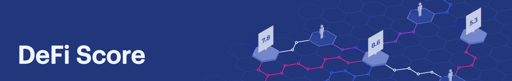

The DeFi Score is a framework for assessing risk in permissionless lending platforms. It's a single, consistently comparable value for measuring protocol risk, based on factors including smart contract risk, collateralization, and liquidity.

We encourage the Ethereum community to evolve the methodology, making it more effective and easier to use.

Join the discussion on [Telegram](https://t.me/defiscore).

### The Components
We detail a few of the core components of the score.

<dl>
  <dt>Is the smart contract open source?</dt>
  <dd>Part of the promise of DeFi is that the functionality of smart contracts is completely on-chain, which means they are verifiable and transparent. Developers of DeFi platforms still have the ability to obscure their code in various ways, such as not verifying the bytecode and using off chain oracles processes. Security through obscurity offers weak security guarantees at best, and at worst results in delays in finding critical bugs.</dd>
</dl>

### Key Contributors:
* Jack Clancy

### Additional Contributors:
* Jordan Lyall
* Todd Murtha
* Thomas Lipari
* [and the rest]

### Community
Join the DeFi Score community on [Telegram](https://t.me/defiscore).

### License
 This work is licensed under a <a rel="license" href="http://creativecommons.org/licenses/by-sa/2.0/">Creative Commons Attribution-ShareAlike 2.0 Generic License</a>.
