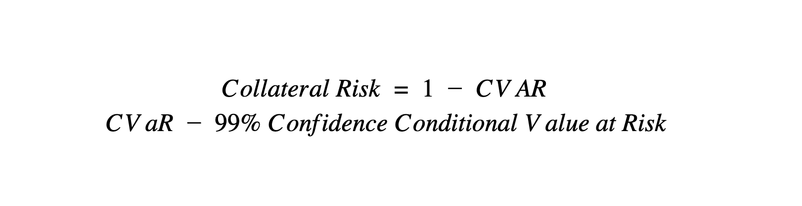
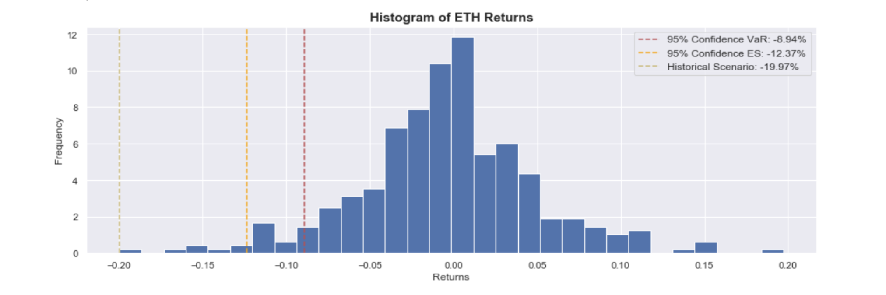

# DeFi Score: Assessing Risk in Permissionless Lending Protocols

## tl;dr
This article introduces a model for assessing risk levels in various permissionless lending protocols. To account for the variety of risks present in these platforms, we use a multi-factor model that looks at smart contract, financial and centralization risks. The model uses a mix of public off-chain and on-chain data to best estimate the relative levels of risk across multiple different permissionless, Ethereum-based lending products.

## Table of Contents

- [DeFi Score: Assessing Risk in Permissionless Lending Protocols](#defi-score-assessing-risk-in-permissionless-lending-protocols)
  - [tl;dr](#tldr)
  - [Table of Contents](#table-of-contents)
  - [Introduction](#introduction)
  - [Overview of Permissionless Lending Protocols](#overview-of-permissionless-lending-protocols)
    - [Smart Contract Risk](#smart-contract-risk)
      - [Code Security](#code-security)
      - [Code Openness](#code-openness)
    - [Financial Risk](#financial-risk)
      - [Collateral](#collateral)
      - [Liquidity](#liquidity)
    - [Centralization & Intermediary Risk](#centralization--intermediary-risk)
      - [Protocol Administration](#protocol-administration)
      - [Oracles](#oracles)
  - [Formula Breakdown](#formula-breakdown)
  - [Limitations](#limitations)
    - [DAI Savings Rate](#dai-savings-rate)
  - [Future Improvements](#future-improvements)
  - [References](#references)
  - [Contributors](#contributors)
    - [Key Contributors:](#key-contributors)
    - [Additional Contributors:](#additional-contributors)
  - [Community](#community)
  - [License](#license)

## Introduction
A major impetus for Satoshi Nakamoto in creating Bitcoin was the 2008 financial crisis. The genesis block of Bitcoin contained a reference to the bank bailouts of that time1. Some felt that the crisis precipitating these bailouts was caused in part by the legacy financial world’s misunderstanding and mispricing of credit risk throughout the financial system. Risk management is one of the most critical pieces of modern financial infrastructure and results in a more robust and safe financial system for all.

In the last year, we have seen an explosion of permissionless financial protocols on the Ethereum blockchain, many catering to the lending and borrowing markets. These markets have grown into the largest sub-category of so-called “decentralized finance” or “DeFi” and experienced 355% YoY growth2. However, not all lending platforms are created equal. Different lending products have very different risk/reward profiles, which makes comparing their rates alone akin to comparing apples to oranges.

Better understanding and modelling of risk in the DeFi space would be an important step towards maturity. There is much work to be done, but now is the time to start. Hopefully this model and others like it can begin to lay the groundwork for robust risk evaluation in DeFi.

Here, we introduce a quantitative model for assessing risk levels in various permissionless lending protocols.

1https://www.blockchain.com/btc/tx/4a5e1e4baab89f3a32518a88c31bc87f618f76673e2cc77ab2127b7afdeda33b
2According to DeFi Pulse Total Value Locked (TVL)  lending category data

## Overview of Permissionless Lending Protocols
Permissionless lending protocols are systems that allow users to lend and borrow various different digital assets typically through so-called “smart contracts” on the Ethereum blockchain. These “smart contracts” are not contracts in the legal sense; rather, they are computer code that effectively lives and executes on the Ethereum blockchain. Users that lend assets are distributed the interest earned from their loans. Borrowers post collateral, typically greater than the value of the loan, and pay a variable interest rate. Some examples of permissionless lending protocols include Compound, dYdX and Nuo.

### Smart Contract Risk
Smart Contract Risk is the main contributor to counterparty risk in DeFi. While DeFi is often referred to as trustless, a user of a DeFi platform must trust the smart contract they are interacting with. A smart contract could be opaque to a user, which means a user is trusting the contract code in the same way a user trusts any web 2.0 infrastructure. There is also the risk that a smart contract is hacked because it is insecure, which has grave financial implications for any and all users of the hacked contract, including, for example, loss of all collateral locked in the contract. Our proposed model looks at two elements of smart contract risk.

#### Code Security
The security of smart contracts are extremely important when evaluating the risk of users losing funds that are stored in a smart contract when interacting with many DeFi platforms. As the ecosystem has learned, errors in smart contracts can result in significant financial damage. For example, the so-called “DAO hack” was an attack launched against a project commonly referred to as “The DAO,” which was an early example of a Decentralized Autonomous Organization ‐‐ i.e., a “virtual” organization embodied in smart contracts on the Ethereum blockchain.3 On June 17, 2016, an unknown individual or group began rapidly diverting ETH from The DAO, causing approximately 3.6 million ETH—1/3 of The DAO’s total ETH—to move from The DAO’s Ethereum Blockchain address to an Ethereum Blockchain address controlled by the attacker.4

While no smart contract can be guaranteed as safe and free of bugs, a thorough code audit and formal verification process from a reputable security firm helps uncover critical, high severity bugs that otherwise could result in financial harm to users. Bug bounty programs are another positive indicator that the development team takes security seriously by incentivizing independent security researchers to discover protocol bugs, ultimately allowing for a more widespread security review.

Our model assesses code security by looking at three pieces of off-chain but public data:

  1. **Time on Mainnet - (25%):** Normalized time since the protocol first launched on mainnet
  2. **No Critical Vulnerabilities:** No vulnerabilities have been exploited
  3. **Four Engineer Weeks** 4 or more engineer weeks have been dedicated to auditing the protocol
  4. **Public Audit:** Has the audit report been made public
  5. **Recent Audit:** Has there been an audit in the last 12 months **OR** have no code changes been made
  6. **Bounty Program:** Does the development team offers a public bug bounty program?

3Securities and Exchange Commission, Release No. 81207, https://www.sec.gov/litigation/investreport/34‐81207.pdf (“SEC DAO Report”) at 1.

4Id. at 9. The DAO hack funds were ultimately recovered through an extraordinary “fork” of the Ethereum blockchain, id., but such forks cannot be expected to recover from future hacks.

### Financial Risk
DeFi contains many of the same risks as legacy finance. While most lending platforms use over-collateralization to reduce credit risk, over-collateralization does not completely remove credit risk. Crypto assets are notoriously volatile and these platforms have no method to recover from system insolvency caused by volatile collateral assets.

The current model looks at two elements of financial risk:

#### Collateral
Without a widely accepted approach to on-chain reputation or identity, the only method to avoid unwanted amounts of credit risk in DeFi money market platforms is to use over-collateralization. While all of the current platforms use very conservative collateral factors, the highly volatile nature of crypto assets means that these high collateral factors may still be insufficient.

The makeup of collateral assets that back these DeFi platforms also have a high level of variation, with some being made up of much more liquid5, stable assets than others. For example, a platform may be primarily backed by ETH. While ETH is still a very volatile asset, it is relatively stable and liquid compared to an asset like LINK6. These collateral makeup differences are an important factor when thinking about platform risk.

Collateral Risk is assessed by looking at two pieces of data, both derivable from on-chain data. The first data point is the utilization rate, which is normalized using min-max normalization across all of the available lending pools.  The second data point is an analysis of the collateral portfolio.

There are many different models to assess the risk of a portfolio of assets. One of the most common models is the VaR (Value at Risk) model. There are multiple different variations of the VaR model. This model currently uses the CVaR (Conditional Value at Risk) model, also known as the Expected Shortfall model. The methodology uses CVaR over VaR because CVaR better captures the probability and drawdown of more extreme scenarios known as black swans. The above figure helps demonstrate this difference-- the CVAR (ES) model results in a larger potential drawdown. Due to the nascency and extreme volatility present in crypto assets, the methodology is more conservative. The model uses the 99% CVaR model with the following formula:

 

The complement of the percentage is taken as a higher CVAR is worse because it means that a higher percentage of the total Collateral is at risk.

5Based on CoinMarketCap data ETH over the last 30d has done ~$190.7B in volume while LINK has done ~$2.2B

6Based on Yahoo Finance data, 30 day annualized volatility has been as high as ~330 for LINK-USD and as high as 165 for ETH-USD in the past year

#### Liquidity
The currently scoped platforms all attempt to incentive liquidity by using dynamic interest rate models which produce varying rates depending on the level of liquidity in each asset pool. However, incentivized liquidity does not mean guaranteed liquidity. A user takes on risk that they will not be able to withdraw their lent out assets on demand because all the assets are currently lent out.

Liquidity risk is assessed by a single data point that is derivable from on-chain data, which is the level of liquidity. This data point is pool's liquidity level, normalized using logarithmic min-max normalization of the amount of liquidity in USD across all of the available lending pools.

### Centralization & Intermediary Risk
Centralization risk is an important risk to consider when lending money with DeFi protocols. Different DeFi protocols have different levels of centralization risk, and the DeFi Score should attempt to highlight them.

#### Protocol Administration
One of the biggest contributors to centralization risk in DeFi protocols is the use of admin keys. Admin keys allow protocol developers to change different parameters of their smart contract systems like oracles, interest rates and potentially more. Protocol developer’s’ ability to alter these contract parameters allows them to cause financial loss to users. Measures like timelocks and multi-signature wallets help mitigate the risk of financial loss due to centralized elements. Mult-signature wallets help mitigate this risk by distributing control to a larger number of developers, meaning that the loss or compromise of a single private key cannot compromise the entire system.  Timelocks help mitigate risk by allowing protocol users to exit their positions before a change can take place. 

| Score        | Description           | 
| ------------ |-------------| 
| 1    | Admin keys without timelock  | 
| 2    | Admin keys with timelock      |
| 3 | Admin keys with timelock and multisig  |
| 4 | No admin keys - autonomous/decentralized governance | 

#### Oracles
Another large element of centralization risk in these protocols is oracle centralization. There are many different flavors of oracle systems being used to power these protocols. Some protocols use a fully self-operated oracle system while others use externally operated oracles like Uniswap and Kyber. Samczun’s writeup on oracles and their ability to cause financial loss provides good background information. The oracle centralization score is not focused on whether these price feeds are manipulatable or not (they all are), but whether a single entity can manipulate them with ease. In the self-operated model, it only takes the oracle owner to manipulate its data. Decentralized oracles can’t be manipulated in the same way, but may not always represent the fair market value for an asset, which is why developers building on top of decentralized oracles opt to use price volatility bounds to defend against these types of attacks.

| Score        | Description           | 
| ------------ |-------------| 
| 1    | Only centralized self-operated oracles used  | 
| 2    | Mix of centralized and decentralized oracles used      |
| 3 | Only decentralized oracles used  |
| 4 | No oracles needed | 

## Formula Breakdown

1. Smart Contract Risk (45%)
* Time on Mainnet (11.25%)
* No Critical Vulnerabilities (9%)
* Engineering Weeks (4.5%)
* Recent Audit or no code changes (6.75%)
* Public Audit (6.75%)
* Bug Bounty (6.75%)

2. Financial Risk (30%)
* Collateral Makeup CVaR (10%)
* Utilization Ratio (10%)
* Absolute Liquidity (10%)

3. Centralization Risk (25%)
* Protocol Administration (12.5%)
* Oracles (12.5%)

## Limitations
This is not a validated statistical model. There is not enough data to properly validate this model on a product wide basis. This is an opinion based estimation framework to estimate the risks associated with different DeFI platforms.

This rating methodology is based on the opinions of the investment quality on a relatively short term basis (less than one year). These recommendations are also not indicative of the size of the investment, which may have a material impact on the level of liquidity risk. This methodology is in an early stage and any users of this rating system should expect frequent updates.

This methodology attempts to compare different DeFi money market platforms on a relative basis, not on an absolute basis. This is a comparison between other DeFi money market platforms and legacy financial investments, like deposit accounts. The DeFi space is extremely nascent, and without a wealth of historical data, it is more difficult to make forward-looking statements.

__This model does not consider many other risks that are relevant to these products, such as liquidation policies.__

### DAI Savings Rate
Although the model was designed specifically for lending pools, the ability to earn money through the DAI Savings Rate is such a significant earning opportunity that we felt very strongly that it should be scored and included in our reference python implementation. Despite the fact that we have plans to design a model that better fits this (somewhat unique) opportunity, there was enough interest to warrant adding a preliminary score based off a few of DSR's characteristics. Here is the breakdown of its score:

| Category   | Score   |
| ---------- | ------- |
| Smart Contract Risk | 45/45 |
| Financial Risk | 30/30 |
| Centralization Risk | 21.875/25 |
| **Total** | **96.875/100** |  

Some notes:
* Because its smart contract has been audited, had its bytecode verified, has been formally verified, and has a bug bounty program, it gets a perfect score for "Smart Contract Risk."
* What the DeFi Score calls "Financial Risk" does not apply to the earning opportunity presented by DSR. Because of this, DSR gets a perfect score for this category.
* Because the protocol has a multisig admin key with a timelock and does not require oracles, it gets 7/8 of 25% for "Centralization Risk."

## Future Improvements
There is much work still to do on this model. This is early stage research. This model needs more fine-tuning and validation. There is also a need to include other relevant risks in this model, like liquidation policy risks. Some of these are hard to quantify, which is why they were not included in the initial iteration.

Eventually, it might also make sense to break some of these scoring sub components down into their own, more robust scoring algorithms. This way the subcomponents can be composed to score different types of blockchain finance products. Future coverage could include additional DeFi earning products like Set, synthetic asset products like Maker and UMA, market making products like Uniswap and the various CeFI counterparts of these products.

Another eventual goal is to provide an API for this and other scoring algorithms that other first and second layer DeFi products would be able to leverage. This will allow for improved user education and outcomes in the space.

This methodology will be initially open sourced on Github, but the eventual goal is to make the model more community managed by allowing for decentralized governance to determine factor weighting and factor inclusion.

The eventual goal of this research is to converge all of the work done into a sort of risk DAO, that could act like an open source credit rating agency that would determine methodologies and provide grant funding to engineers, risk management experts and others that contribute to this living body of work. While the amount of risk management work that needs to be done in the space is daunting, we are excited about the future.

## References
1. Evans, Alex. “A Ratings-Based Model for Credit Events in MakerDAO.” A Ratings-Based Model for Credit Events in MakerDAO. Placeholder VC, July 2019. https://static1.squarespace.com/static/5a479ee3b7411c6102f75729/t/5d37587d026881000198ef51/1563908221879/Maker-Ratings.pdf.
2. Nakamoto, Satoshi. “Bitcoin Genesis Block.” Blockchain, January 3, 2009. https://www.blockchain.com/btc/tx/4a5e1e4baab89f3a32518a88c31bc87f618f76673e2cc77ab2127b7afdeda33b?show_adv=true.
3. Callagy, Robert, Vanessa Robert, Marc Pinto, and Daniel Marty. “Money Market Funds.” Money Market Funds. New York, NY: Moody's Investor Service, 2019.

## Contributors
### Key Contributors:
* Jack Clancy

### Additional Contributors:
* [Jordan Lyall](https://3box.io/0xcf88fa6ee6d111b04be9b06ef6fad6bd6691b88c/)
* [Todd Murtha](https://www.3box.io/0x3e5a3f30695949ce0541c8f1843acbdf1557a382)
* [Thomas Lipari](https://3box.io/0xcb28e9eaf9fed40c3147fa832a4afdef28a8684b)

## Community
Join the DeFi Score community on [Telegram](https://t.me/defiscore).

## License
 This work is licensed under a <a rel="license" href="http://creativecommons.org/licenses/by-sa/2.0/">Creative Commons Attribution-ShareAlike 2.0 Generic License</a>.
